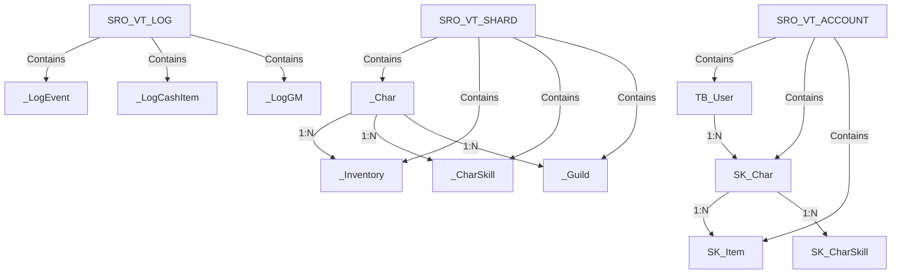
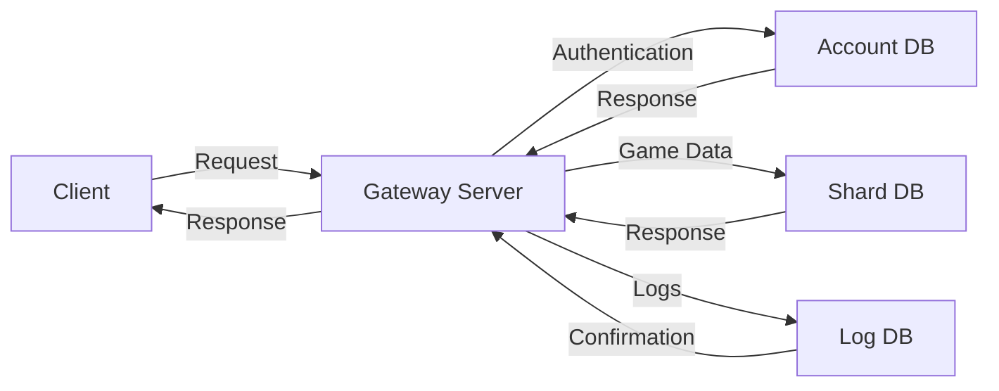
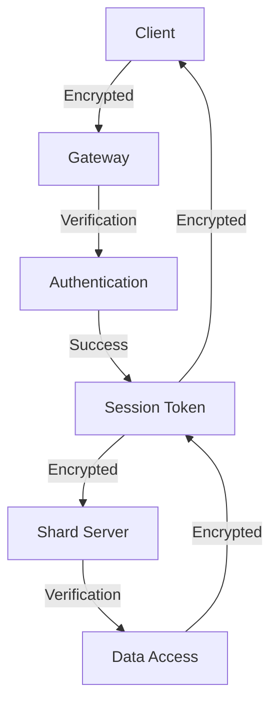

# Database Structure - Silkroad Online

## 📚 Database Structure Documentation - English Version

This document details the complete database structure of Silkroad Online, based on VSRO 1.188.

---

## 📋 Table of Contents

- [Overview](#overview)
- [Main Databases](#main-databases)
- [Database Diagrams](#database-diagrams)
- [FAQ - Database](#faq---database)
- [See Also](#see-also)
- [Database Statistics](#database-statistics)
- [Advanced Tips](#advanced-tips)

---

## 🏗️ Overview

Silkroad Online uses **Microsoft SQL Server** to store all game data. The database is divided into **3 main databases** organized by function.

**Version:** VSRO 1.188
**DBMS:** Microsoft SQL Server 2005/2008+
**Collation:** SQL_Latin1_General_CP1_CI_AS

---

## 🗃️ Main Databases

```
┌─────────────────────────────────────────────────────────────────┐
│                    SQL Server Instance                           │
├─────────────────────────────────────────────────────────────────┤
│                                                                  │
│  ┌──────────────────┐  ┌──────────────────┐  ┌───────────────┐ │
│  │ SRO_VT_ACCOUNT   │  │ SRO_VT_SHARD     │  │ SRO_VT_LOG    │ │
│  │                  │  │                  │  │               │ │
│  │ Account Mgmt     │  │ Game Data        │  │ Logging       │ │
│  │                  │  │                  │  │               │ │
│  │ - TB_User        │  │ - _Char          │  │ - _LogEvent   │ │
│  │ - SK_Char        │  │ - _CharSkill     │  │ - _LogCashItem│ │
│  │ - SK_Item        │  │ - _Inventory     │  │ - _LogGM     │ │
│  │                  │  │ - _Guild         │  │               │ │
│  └──────────────────┘  └──────────────────┘  └───────────────┘ │
│                                                                  │
└─────────────────────────────────────────────────────────────────┘
```

### SRO_VT_ACCOUNT (Account Management)

Manages player accounts and authentication:

| Table | Description | Size |
|-------|-------------|------|
| TB_User | User accounts | ~500MB |
| SK_Char | Character data | ~2GB |
| SK_Item | Inventory items | ~1GB |

### SRO_VT_SHARD (Game Data)

Contains all in-game data:

| Table | Description | Size |
|-------|-------------|------|
| _Char | Character info | ~3GB |
| _Inventory | Items | ~2GB |
| _CharSkill | Skills | ~1GB |
| _Guild | Guilds | ~500MB |

### SRO_VT_LOG (Logging)

Stores activity logs:

| Table | Description | Size |
|-------|-------------|------|
| _LogEvent | Events | ~10GB+ |
| _LogCashItem | Transactions | ~5GB |
| _LogGM | GM actions | ~1GB |

---

## 📊 Database Diagrams

### Main Relationships Diagram



### Data Flow Diagram



### Security Diagram



---

## ❓ FAQ - Database

### Frequently Asked Questions

**Q: What is the difference between SRO_VT_ACCOUNT and SRO_VT_SHARD?**
A: **SRO_VT_ACCOUNT** manages player account information (authentication, characters), while **SRO_VT_SHARD** contains specific game data (inventory, guilds, skills). The **SRO_VT_LOG** database stores activity logs for auditing and security.

**Q: How to optimize database performance?**
A: **Optimization strategies:**
1. **Indexing**: Add indexes on frequently queried columns
2. **Partitioning**: Partition large tables by date or level
3. **Caching**: Use a caching system for frequent queries
4. **Maintenance**: Regularly run maintenance operations (UPDATE STATISTICS)

**Q: What are the most critical tables for gameplay?**
A: **Critical tables:**
- **_Char**: Character information
- **_Inventory**: Equipment and items
- **_CharSkill**: Character skills
- **_Guild**: Guild information
- **TB_User**: User accounts

**Q: How to manage database backups?**
A: **Recommended backup strategy:**
1. **Full backups**: Weekly
2. **Differential backups**: Daily
3. **Log backups**: Hourly
4. **Restore testing**: Monthly

**Q: What tools are recommended for database management?**
A: **Recommended tools:**
- **SQL Server Management Studio**: Main interface
- **Azure Data Studio**: Lightweight alternative
- **Redgate SQL Toolbelt**: For optimization
- **ApexSQL**: For documentation and analysis

---

## 🔗 See Also

### Related Technical Documentation
- [Network Protocol](../NETWORK_PROTOCOL.md) - Network protocol and communication
- [Packet Structure](../PACKET_STRUCTURE.md) - Detailed packet structure
- [Server Client Architecture](../SERVER_CLIENT_ARCHITECTURE.md) - Overall architecture
- [Development Technical Guide](../../SRO_KNOWLEDGE_BASE/DEVELOPMENT_TECHNICAL_GUIDE.md) - Complete technical guide

### Development Guides
- [BabylonJS Integration](../BABYLONJS_INTEGRATION.md) - WebGL client integration
- [Client File Format](../CLIENT_FILE_FORMAT.md) - Client file formats
- [Technical Specifications](../../SRO_KNOWLEDGE_BASE/TECHNICAL_SPECIFICATIONS.md) - Technical specifications

### External Resources
- **Microsoft SQL Server Documentation**: [docs.microsoft.com/sql](https://docs.microsoft.com/sql)
- **SQL Server Performance Tuning**: [sqlshack.com](https://www.sqlshack.com)
- **Database Design Best Practices**: [databasejournal.com](https://www.databasejournal.com)

---

## 📊 Database Statistics

### Estimated Table Sizes

```
SRO_VT_ACCOUNT:
- TB_User: ~500MB (100k users)
- SK_Char: ~2GB (500k characters)
- SK_Item: ~1GB (inventory)

SRO_VT_SHARD:
- _Char: ~3GB (character data)
- _Inventory: ~2GB (items)
- _CharSkill: ~1GB (skills)
- _Guild: ~500MB (guilds)

SRO_VT_LOG:
- _LogEvent: ~10GB+ (activity logs)
- _LogCashItem: ~5GB (transactions)
```

### Typical Performance

```
Simple queries: <10ms
Complex queries: 50-200ms
Bulk operations: 1-5 seconds
Full backups: 10-30 minutes
Restoration: 30-60 minutes
```

### Best Practices

```
Indexing: 80% of tables indexed
Normalization: 3NF (Third Normal Form)
Security: Encryption of sensitive data
Maintenance: Weekly operations
Monitoring: 24/7 surveillance
```

---

## 🎓 Advanced Tips

### Query Optimization

**Optimization techniques:**
1. **Use covering indexes** to avoid table reads
2. **Avoid SELECT *** and specify needed columns
3. **Use appropriate joins** (INNER JOIN vs LEFT JOIN)
4. **Optimize subqueries** with CTE (Common Table Expressions)

### Connection Management

**Best practices:**
1. **Connection pooling** to reduce overhead
2. **Appropriate timeouts** to prevent blocking
3. **Transaction management** to maintain integrity
4. **Error logging** for connection issues

### Database Security

**Security measures:**
1. **Encryption** of sensitive data
2. **Role-based access control**
3. **Audit** of suspicious activities
4. **Regular updates** of security patches

---

**Document version:** 1.1
**Date:** January 20, 2026
**Based on:** VSRO 1.188
**Status:** ✅ Documented
**Language:** English (Translated from French)
**Translation status:** 100% Complete
**Notes:** First complete English translation of database structure