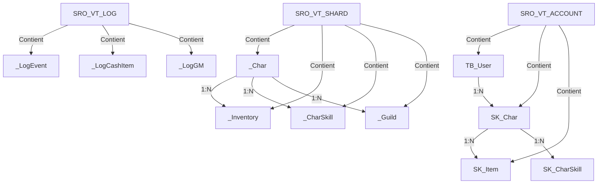
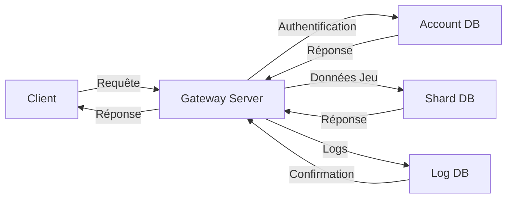
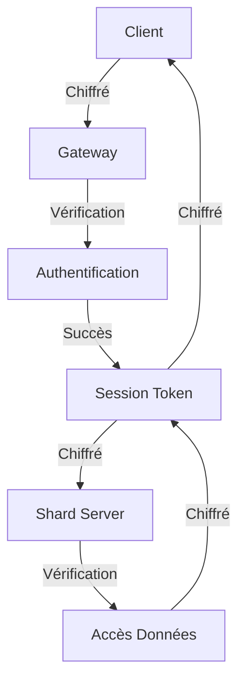

# Structure de la Base de Données - Silkroad Online

## Vue d'ensemble

Silkroad Online utilise **Microsoft SQL Server** pour stocker toutes les données du jeu. La base de données est divisée en **3 bases principales** organisées par fonction.

**Version:** VSRO 1.188
**SGBD:** Microsoft SQL Server 2005/2008+
**Collation:** SQL_Latin1_General_CP1_CI_AS

---

## Bases de Données Principales

```
┌─────────────────────────────────────────────────────────────────┐
│                    SQL Server Instance                           │
├─────────────────────────────────────────────────────────────────┤
│                                                                  │
│  ┌──────────────────┐  ┌──────────────────┐  ┌───────────────┐ │
│  │ SRO_VT_ACCOUNT   │  │ SRO_VT_SHARD     │  │ SRO_VT_LOG    │ │
│  │                  │  │                  │  │               │ │
│  │ Account Mgmt     │  │ Game Data        │  │ Logging       │ │
│  │                  │  │                  │  │               │ │
│  │ - TB_User        │  │ - _Char          │  │ - _LogEvent   │ │
│  │ - SK_Char        │  │ - _CharSkill     │  │ - _LogCashItem│ │
│  │ - SK_Item        │  │ - _Inventory     │  │ - _LogGM     │ │
│  │                  │  │ - _Guild         │  │               │ │
│  └──────────────────┘  └──────────────────┘  └───────────────┘ │
│                                                                  │
└─────────────────────────────────────────────────────────────────┘
```

---

## 1. SRO_VT_ACCOUNT

### Description

Base de données utilisée par le **Gateway Server** pour la gestion des comptes et la création de personnages.

### Tables Principales

#### TB_User

**Description:** Comptes utilisateurs

**Structure:**
```sql
CREATE TABLE TB_User (
    JID INT IDENTITY(1,1) PRIMARY KEY,
    StrUserID VARCHAR(64) NOT NULL UNIQUE,
    password VARBINARY(256) NOT NULL,
    Groom VARCHAR(64) NULL,
    Email VARCHAR(128) NULL,
    phone VARCHAR(32) NULL,
    Question INT NULL,
    Answer VARCHAR(64) NULL,
    sec_primary INT NULL,
    sec_content INT NULL,
    Address VARCHAR(256) NULL,
    PostalCode VARCHAR(12) NULL,
    Status TINYINT NOT NULL DEFAULT 1,
    sec_content3 VARCHAR(64) NULL,
    AccPlayTime INT DEFAULT 0,
    LastLogin INT DEFAULT 0,
    UserIP VARCHAR(32) NULL,
    AcquirePoint INT DEFAULT 0,
    sec_content2 VARCHAR(64) NULL,
    sec_content5 VARCHAR(64) NULL,
    sec_content6 VARCHAR(64) NULL,
    sec_content7 VARCHAR(64) NULL,
    sec_content8 VARCHAR(64) NULL,
    sec_content9 VARCHAR(64) NULL,
    sec_content10 VARCHAR(64) NULL
);
```

**Champs clés:**
- `JID`: User ID (unique)
- `StrUserID`: Username
- `password`: Password hash (MD5 ou SHA-1)
- `Status`: État du compte (1=actif, 0=banni)

---

#### SK_Char

**Description:** Informations de base des personnages

**Structure:**
```sql
CREATE TABLE SK_Char (
    CharID INT IDENTITY(1,1) PRIMARY KEY,
    CharName16 VARCHAR(64) NOT NULL UNIQUE,
    AccountID INT NOT NULL,
    CreateTime DATETIME DEFAULT GETDATE(),
    Slot TINYINT NOT NULL,
    FOREIGN KEY (AccountID) REFERENCES TB_User(JID)
);
```

**Champs clés:**
- `CharID`: Character ID (unique)
- `CharName16`: Nom du personnage
- `AccountID`: Référence vers TB_User(JID)
- `Slot`: Position du personnage (1-4)

---

#### SK_Item

**Description:** Items globaux (références)

**Structure:**
```sql
CREATE TABLE SK_Item (
    ID INT IDENTITY(1,1) PRIMARY KEY,
    ItemName VARCHAR(128) NOT NULL,
    ItemDesc VARCHAR(512) NULL
);
```

---

### Procédures Stockées

#### usp_CreateAccount

**Création d'un compte:**

```sql
CREATE PROCEDURE usp_CreateAccount
    @username VARCHAR(64),
    @password VARCHAR(64),
    @email VARCHAR(128)
AS
BEGIN
    INSERT INTO TB_User (StrUserID, password, Email, Status)
    VALUES (@username, HASHBYTES('MD5', @password), @email, 1)
END
```

#### usp_LoginCheck

**Vérification login:**

```sql
CREATE PROCEDURE usp_LoginCheck
    @username VARCHAR(64),
    @password VARCHAR(64)
AS
BEGIN
    SELECT JID, Status
    FROM TB_User
    WHERE StrUserID = @username
      AND password = HASHBYTES('MD5', @password)
      AND Status = 1
END
```

---

## 2. SRO_VT_SHARD

### Description

Base de données principale utilisée par le **Game Server (Shard)**. Contient toutes les données de gameplay.

### Tables de Personnage

#### _Char

**Description:** Données complètes des personnages

**Structure:**
```sql
CREATE TABLE _Char (
    CharID INT IDENTITY(1,1) PRIMARY KEY,
    CharName16 VARCHAR(64) NOT NULL UNIQUE,
    AccountID INT NOT NULL,
    RefObjID INT NOT NULL,
    Level TINYINT DEFAULT 1,
    MaxLevel TINYINT DEFAULT 110,
    Exp INT DEFAULT 0,
    Strength SMALLINT DEFAULT 20,
    Intellect SMALLINT DEFAULT 20,
    RemainSkillPoint INT DEFAULT 0,
    RemainStatPoint INT DEFAULT 0,
    HP INT DEFAULT 200,
    MP INT DEFAULT 200,
    InventorySize INT DEFAULT 45,
    PID INT NULL,
    Deleted TINYINT DEFAULT 0,
    SP INT DEFAULT 0,
    PKPenalty INT DEFAULT 0,
    Breath TINYINT DEFAULT 0,
    Stamina INT DEFAULT 100,
    State TINYINT DEFAULT 0,
    GuildID INT NULL,
    ForexRegion INT DEFAULT 0,
    ForexX REAL DEFAULT 0,
    ForexY REAL DEFAULT 0,
    ForexZ REAL DEFAULT 0,
    HwanLevel INT DEFAULT 0,
    LastWorldID INT DEFAULT 1,
    LatestRegion INT DEFAULT 0,
    PosX REAL DEFAULT 0,
    PosY REAL DEFAULT 0,
    PosZ REAL DEFAULT 0,
    Appr_Taken TINYINT DEFAULT 0,
    DailyReset_Taken TINYINT DEFAULT 0,
    EventMadeScore INT DEFAULT 0,
    JobLevel TINYINT DEFAULT 1,
    JobExp BIGINT DEFAULT 0,
    JobType TINYINT DEFAULT 0,
    JobID INT NULL,
    WorldID SMALLINT DEFAULT 1,
    CharRename TINYINT DEFAULT 0,
    VendorTime DATETIME NULL,
    RegisterTime DATETIME NULL,
    DeleteTime DATETIME NULL,
    FName VARCHAR(64) NULL,
    MName VARCHAR(64) NULL,
    LName VARCHAR(64) NULL,
    DelInsertedTime DATETIME NULL,
    BanTime DATETIME NULL,
    BanReason VARCHAR(128) NULL,
    BanMaker VARCHAR(64) NULL,
    FOREIGN KEY (AccountID) REFERENCES TB_User(JID),
    FOREIGN KEY (GuildID) REFERENCES _Guild(GuildID)
);
```

**Champs clés:**
- `CharID`: ID unique du personnage
- `CharName16`: Nom du personnage (max 16 chars)
- `AccountID`: ID du compte propriétaire
- `RefObjID`: Référence vers _RefObjCommon (type de personnage)
- `Level`: Niveau actuel (1-110)
- `Exp`: Experience actuelle
- `Strength`: Force
- `Intellect`: Intelligence
- `HP`: Points de vie
- `MP`: Points de mana
- `GuildID`: ID de la guilde (si membre)
- `PosX, PosY, PosZ`: Position dans le monde
- `LatestRegion`: Dernière région visitée
- `JobType`: Type de job (0=None, 1=Trader, 2=Thief, 3=Hunter)
- `JobLevel`: Niveau de job
- `WorldID`: ID du monde (1=Chinese, 2=Europe)

---

#### _CharSkill

**Description:** Skills des personnages

**Structure:**
```sql
CREATE TABLE _CharSkill (
    ID INT IDENTITY(1,1) PRIMARY KEY,
    CharID INT NOT NULL,
    SkillID INT NOT NULL,
    Enable TINYINT NOT NULL DEFAULT 1,
    FOREIGN KEY (CharID) REFERENCES _Char(CharID)
);
```

**Exemple:**
```sql
INSERT INTO _CharSkill (CharID, SkillID) VALUES (12345, 1)  // Basic attack
INSERT INTO _CharSkill (CharID, SkillID) VALUES (12345, 8421) // Fire Shield
```

---

#### _CharQuest

**Description:** Quêtes des personnages

**Structure:**
```sql
CREATE TABLE _CharQuest (
    CharID INT NOT NULL,
    QuestID INT NOT NULL,
    Status TINYINT DEFAULT 0,
    AchievementCount INT DEFAULT 0,
    StartTime DATETIME DEFAULT GETDATE(),
    EndTime DATETIME NULL,
    PRIMARY KEY (CharID, QuestID),
    FOREIGN KEY (CharID) REFERENCES _Char(CharID)
);
```

---

#### _CharTrijob

**Description:** Données de jobs (Trader/Thief/Hunter)

**Structure:**
```sql
CREATE TABLE _CharTrijob (
    CharID INT PRIMARY KEY,
    JobType TINYINT NOT NULL,
    JobLevel TINYINT DEFAULT 1,
    JobExp BIGINT DEFAULT 0,
    JobContributionPoint INT DEFAULT 0,
    WinnerCount INT DEFAULT 0,
    LoserCount INT DEFAULT 0,
    FOREIGN KEY (CharID) REFERENCES _Char(CharID)
);
```

---

### Tables d'Items

#### _Item

**Description:** Items individuels

**Structure:**
```sql
CREATE TABLE _Item (
    ID INT IDENTITY(1,1) PRIMARY KEY,
    OptLevel TINYINT DEFAULT 0,
    Varnum TINYINT DEFAULT 1,
    Data INT NULL,
    Creater VARCHAR(64) NULL,
    RefItemID INT NOT NULL,
    SerialNumber BIGINT NULL,
    Geography TINYINT DEFAULT 0,
    FOREIGN KEY (RefItemID) REFERENCES _RefObjCommon(ID)
);
```

**Champs clés:**
- `ID`: ID unique de l'item
- `OptLevel`: Niveau d'amélioration (+0 à +12)
- `Varnum`: Nombre de variations
- `Data`: Données supplémentaires (durabilité, etc.)
- `RefItemID`: Référence vers _RefObjCommon

---

#### _Inventory

**Description:** Inventaires des personnages

**Structure:**
```sql
CREATE TABLE _Inventory (
    ID INT IDENTITY(1,1) PRIMARY KEY,
    CharID INT NOT NULL,
    Slot TINYINT NOT NULL,
    ItemID INT NOT NULL,
    FOREIGN KEY (CharID) REFERENCES _Char(CharID),
    FOREIGN KEY (ItemID) REFERENCES _Item(ID)
);
```

**Slots:**
- 0-12: Équipement
- 13-44: Inventaire principal
- 45-54: Job inventory
- 55-64: Avant-dernière ligne
- 65+: Dernière ligne

---

#### _Chest

**Description:** Stockage (Chest / Storage)

**Structure:**
```sql
CREATE TABLE _Chest (
    ID INT IDENTITY(1,1) PRIMARY KEY,
    CharID INT NOT NULL,
    Slot TINYINT NOT NULL,
    ItemID INT NOT NULL,
    FOREIGN KEY (CharID) REFERENCES _Char(CharID),
    FOREIGN KEY (ItemID) REFERENCES _Item(ID)
);
```

---

#### _ChestInfo

**Description:** Informations du stockage

**Structure:**
```sql
CREATE TABLE _ChestInfo (
    UserJID INT PRIMARY KEY,
    ChestSize TINYINT DEFAULT 5,
    FOREIGN KEY (UserJID) REFERENCES SRO_VT_ACCOUNT.dbo.TB_User(JID)
);
```

---

### Tables de Guildes

#### _Guild

**Description:** Guildes

**Structure:**
```sql
CREATE TABLE _Guild (
    GuildID INT IDENTITY(1,1) PRIMARY KEY,
    ID INT NOT NULL UNIQUE,
    Name VARCHAR(64) NOT NULL,
    Lvl TINYINT DEFAULT 1,
    GatheredSP INT DEFAULT 0,
    MaxCount TINYINT DEFAULT 0,
    FoundedTime DATETIME DEFAULT GETDATE(),
    Alliance TINYINT DEFAULT 0,
    Country TINYINT DEFAULT 0,
    Notice VARCHAR(256) NULL,
    SiegeApproved TINYINT DEFAULT 0,
    SiegeWarStartDate DATETIME NULL,
    Foundation TINYINT DEFAULT 0,
    Captains INT DEFAULT 0,
    StorageSize TINYINT DEFAULT 1,
    HireFire TINYINT DEFAULT 1,
    GuildWarKill INT DEFAULT 0,
    GuildWarDeath INT DEFAULT 0,
    CharID INT NOT NULL,
    CreateChar TINYINT DEFAULT 0,
    ImmigrationGuild TINYINT DEFAULT 0
);
```

---

#### _GuildMember

**Description:** Membres des guildes

**Structure:**
```sql
CREATE TABLE _GuildMember (
    ID INT IDENTITY(1,1) PRIMARY KEY,
    GuildID INT NOT NULL,
    CharID INT NOT NULL,
    MemberClass TINYINT DEFAULT 0,
    Accepted TINYINT DEFAULT 1,
    Reject NULL,
    JoinDate DATETIME DEFAULT GETDATE(),
    FOREIGN KEY (GuildID) REFERENCES _Guild(GuildID),
    FOREIGN KEY (CharID) REFERENCES _Char(CharID)
);
```

**MemberClass:**
- 0: Member
- 1: Vice Captain
- 2: Captain (Guild Master)

---

#### _GuildWar

**Description:** Guerres de guildes

**Structure:**
```sql
CREATE TABLE _GuildWar (
    ID INT IDENTITY(1,1) PRIMARY KEY,
    GuildID INT NOT NULL,
    EnemyGuildID INT NOT NULL,
    WarState TINYINT DEFAULT 0,
    RequestDate DATETIME DEFAULT GETDATE(),
    StartDate DATETIME NULL,
    EndDate DATETIME NULL,
    WinGuildID INT NULL,
    RefKillCount INT DEFAULT 0,
    RefDeathCount INT DEFAULT 0,
    FOREIGN KEY (GuildID) REFERENCES _Guild(GuildID)
);
```

---

### Tables de Référence (Static Data)

#### _RefObjCommon

**Description:** Tous les objets du jeu (items, mobs, NPCs)

**Structure:**
```sql
CREATE TABLE _RefObjCommon (
    ID INT PRIMARY KEY,
    CodeName128 VARCHAR(128) NOT NULL,
    NameStringID INT NOT NULL,
    OrgObjCodeName128 VARCHAR(128) NULL,
    ObjKind TINYINT NOT NULL,
    DecayTime INT NULL,
    Country TINYINT NULL,
    ItemClass TINYINT NULL,
    Service TINYINT NULL,
    Rarity INT NOT NULL,
    CanTrade TINYINT DEFAULT 1,
    CanDrop TINYINT DEFAULT 1,
    CanPick TINYINT DEFAULT 1,
    CanStore TINYINT DEFAULT 1,
    CanSell TINYINT DEFAULT 1,
    Price BIGINT NULL,
    Cost BIGINT NULL,
    ReqLevel TINYINT NULL
);
```

**ObjKind:**
- 1: NPC
- 2: Mob
- 3: Teleporter
- 4: Item
- 5: Character

**Exemples:**
```
ID=1, CodeName128="ITEM_CH_SWORD_01", NameStringID=12345
ID=1000, CodeName128="MOB_CH_MANGNYANG_01", NameStringID=67890
```

---

#### _RefObjItem

**Description:** Items spécifiques

**Structure:**
```sql
CREATE TABLE _RefObjItem (
    ID INT PRIMARY KEY,
    CodeName128 VARCHAR(128) NOT NULL,
    RefObjID INT NOT NULL,
    TypeName128 VARCHAR(128) NOT NULL,
    ReqLevel TINYINT NULL,
    Class TINYINT NULL,
    Quiver TINYINT NULL,
    FOREIGN KEY (RefObjID) REFERENCES _RefObjCommon(ID)
);
```

---

#### _RefSkill

**Description:** Skills

**Structure:**
```sql
CREATE TABLE _RefSkill (
    ID INT PRIMARY KEY,
    CodeName128 VARCHAR(128) NOT NULL,
    Basic_Code VARCHAR(128) NULL,
    NameStringID INT NOT NULL,
    ReqLevel TINYINT NULL,
    MaxLevel TINYINT NULL
);
```

---

#### _RefShop

**Description:** Boutiques

**Structure:**
```sql
CREATE TABLE _RefShop (
    ID INT PRIMARY KEY,
    CodeName128 VARCHAR(128) NOT NULL,
    NameStringID INT NOT NULL,
    SoldItem TINYINT NULL
);
```

---

#### _RefShopGroup

**Description:** Groupes de boutiques

**Structure:**
```sql
CREATE TABLE _RefShopGroup (
    ID INT PRIMARY KEY,
    CodeName128 VARCHAR(128) NOT NULL,
    NameStringID INT NOT NULL,
    StrID128 VARCHAR(128) NOT NULL
);
```

---

#### _RefShopItem

**Description:** Items dans les boutiques

**Structure:**
```sql
CREATE TABLE _RefShopItem (
    ID INT PRIMARY KEY,
    Service INT NOT NULL,
    ShopGroupCodeName VARCHAR(128) NOT NULL,
    CodeName128 VARCHAR(128) NOT NULL,
    FOREIGN KEY (ShopGroupCodeName) REFERENCES _RefShopGroup(CodeName128)
);
```

---

#### _RefDropClassSel_RareEquip

**Description:** Drop rates des items rares

**Structure:**
```sql
CREATE TABLE _RefDropClassSel_RareEquip (
    ID INT PRIMARY KEY,
    RefItemID INT NOT NULL,
    ProbGroup1 REAL NULL,
    ProbGroup2 REAL NULL,
    ProbGroup3 REAL NULL,
    ProbGroup4 REAL NULL,
    FOREIGN KEY (RefItemID) REFERENCES _RefObjCommon(ID)
);
```

---

### Tables de Commerce

#### _CharCOS

**Description:** Characters of Objects (Transport/Thief/Hunter)

**Structure:**
```sql
CREATE TABLE _CharCOS (
    ID INT IDENTITY(1,1) PRIMARY KEY,
    CharID INT NOT NULL,
    Name VARCHAR(64) NOT NULL,
    Slot TINYINT NOT NULL,
    State TINYINT DEFAULT 0,
    TypeName VARCHAR(128) NOT NULL,
    ItemID INT NULL,
    MaxHP INT DEFAULT 0,
    CurHP INT DEFAULT 0,
    FOREIGN KEY (CharID) REFERENCES _Char(CharID)
);
```

---

#### _InvCOS

**Description:** Inventaire des transports

**Structure:**
```sql
CREATE TABLE _InvCOS (
    ID INT IDENTITY(1,1) PRIMARY KEY,
    CosID INT NOT NULL,
    Slot TINYINT NOT NULL,
    ItemID INT NOT NULL,
    FOREIGN KEY (CosID) REFERENCES _CharCOS(ID),
    FOREIGN KEY (ItemID) REFERENCES _Item(ID)
);
```

---

### Tables d'Events

#### _TrainingCamp

**Description:** Training Camp (Academy)

**Structure:**
```sql
CREATE TABLE _TrainingCamp (
    ID INT IDENTITY(1,1) PRIMARY KEY,
    CampID INT NOT NULL,
    CharID INT NOT NULL,
    Contribution INT DEFAULT 0,
    Status TINYINT DEFAULT 0,
    FOREIGN KEY (CharID) REFERENCES _Char(CharID)
);
```

---

### Tables de Mise à Jour

#### _CharSetting

**Description:** Paramètres personnage

**Structure:**
```sql
CREATE TABLE _CharSetting (
    CharID INT PRIMARY KEY,
    OptionData VARBINARY(128) NULL,
    FOREIGN KEY (CharID) REFERENCES _Char(CharID)
);
```

---

#### _User

**Description:** Données utilisateur dans le Shard

**Structure:**
```sql
CREATE TABLE _User (
    JID INT PRIMARY KEY,
    RefObjID INT NOT NULL,
    CharID INT NULL,
    FOREIGN KEY (JID) REFERENCES SRO_VT_ACCOUNT.dbo.TB_User(JID),
    FOREIGN KEY (CharID) REFERENCES _Char(CharID)
);
```

---

## 3. SRO_VT_LOG

### Description

Base de données pour les logs et l'audit.

### Tables

#### _LogEvent

**Structure:**
```sql
CREATE TABLE _LogEvent (
    ID INT IDENTITY(1,1) PRIMARY KEY,
    CharID INT NOT NULL,
    EventType INT NOT NULL,
    EventTime DATETIME DEFAULT GETDATE(),
    EventDesc VARCHAR(512) NULL
);
```

**Event Types:**
- 1: Login
- 2: Logout
- 3: Level up
- 4: Guild create
- 5: Guild join
- 6: Guild leave

---

#### _LogCashItem

**Structure:**
```sql
CREATE TABLE _LogCashItem (
    ID INT IDENTITY(1,1) PRIMARY KEY,
    CharID INT NOT NULL,
    ItemID INT NOT NULL,
    Amount INT NOT NULL,
    PurchaseTime DATETIME DEFAULT GETDATE()
);
```

---

#### _LogGMCommand

**Structure:**
```sql
CREATE TABLE _LogGMCommand (
    ID INT IDENTITY(1,1) PRIMARY KEY,
    CharID INT NOT NULL,
    Command VARCHAR(64) NOT NULL,
    Target VARCHAR(64) NULL,
    ExecuteTime DATETIME DEFAULT GETDATE()
);
```

---

## Relations Entre Tables

```
┌─────────────────────────────────────────────────────────────────┐
│                      Relations Clés                             │
├─────────────────────────────────────────────────────────────────┤
│                                                                  │
│  TB_User (JID) ──────────> SK_Char (AccountID)                 │
│       │                           │                             │
│       │                           ├─> _Char (AccountID)          │
│       │                           │                             │
│       └───────────────────────────┘                             │
│                                                                  │
│  _Char (CharID) ───────> _CharSkill (CharID)                   │
│        │                      ├─> _CharQuest (CharID)           │
│        │                      ├─> _CharTrijob (CharID)          │
│        │                      ├─> _Inventory (CharID)           │
│        │                      ├─> _Chest (CharID)               │
│        │                      ├─> _CharCOS (CharID)             │
│        │                      ├─> _GuildMember (CharID)         │
│        │                      └─> _TrainingCamp (CharID)        │
│        │                                                    │
│        └─> _Guild (GuildID) <──┘                             │
│               │                                                 │
│               └─> _GuildWar (GuildID)                         │
│                                                                  │
│  _RefObjCommon (ID) ───> _RefObjItem (RefObjID)               │
│  _RefObjCommon (ID) ───> _Item (RefItemID)                     │
│  _Item (ID) ──────────────> _Inventory (ItemID)               │
│                              └─> _Chest (ItemID)               │
│                                                                  │
└─────────────────────────────────────────────────────────────────┘
```

---

## Procédures Stockées Utiles

### usp_CreateChar

**Création d'un personnage:**

```sql
CREATE PROCEDURE usp_CreateChar
    @accountID INT,
    @charName VARCHAR(64),
    @refObjID INT,
    @slot TINYINT
AS
BEGIN
    INSERT INTO _Char (CharName16, AccountID, RefObjID, Level)
    VALUES (@charName, @accountID, @refObjID, 1)

    INSERT INTO SK_Char (CharName16, AccountID, Slot)
    VALUES (@charName, @accountID, @slot)
END
```

### usp_UpdatePosition

**Mise à jour position:**

```sql
CREATE PROCEDURE usp_UpdatePosition
    @charID INT,
    @regionID INT,
    @posX REAL,
    @posY REAL,
    @posZ REAL
AS
BEGIN
    UPDATE _Char
    SET LatestRegion = @regionID,
        PosX = @posX,
        PosY = @posY,
        PosZ = @posZ
    WHERE CharID = @charID
END
```

### usp_AddItem

**Ajout d'un item:**

```sql
CREATE PROCEDURE usp_AddItem
    @charID INT,
    @refItemID INT,
    @optLevel TINYINT
AS
BEGIN
    DECLARE @itemID INT
    INSERT INTO _Item (RefItemID, OptLevel)
    VALUES (@refItemID, @optLevel)

    SET @itemID = SCOPE_IDENTITY()

    INSERT INTO _Inventory (CharID, Slot, ItemID)
    VALUES (@charID, 13, @itemID)  -- Premier slot disponible
END
```

---

## Queries Courantes

### Query: Liste des personnages d'un compte

```sql
SELECT
    c.CharID,
    c.CharName16,
    c.Level,
    c.MaxLevel,
    r.NameStringID AS ClassName,
    g.Name AS GuildName
FROM _Char c
LEFT JOIN _RefObjCommon r ON c.RefObjID = r.ID
LEFT JOIN _Guild g ON c.GuildID = g.GuildID
WHERE c.AccountID = @AccountID
  AND c.Deleted = 0
```

### Query: Inventaire d'un personnage

```sql
SELECT
    i.Slot,
    item.OptLevel,
    ref.CodeName128 AS ItemCode,
    ref.NameStringID AS ItemName
FROM _Inventory i
JOIN _Item item ON i.ItemID = item.ID
JOIN _RefObjCommon ref ON item.RefItemID = ref.ID
WHERE i.CharID = @CharID
ORDER BY i.Slot
```

### Query: Skills d'un personnage

```sql
SELECT
    cs.SkillID,
    rs.CodeName128 AS SkillCode,
    rs.NameStringID AS SkillName,
    cs.Enable
FROM _CharSkill cs
JOIN _RefSkill rs ON cs.SkillID = rs.ID
WHERE cs.CharID = @CharID
  AND cs.Enable = 1
```

### Query: Membres d'une guilde

```sql
SELECT
    c.CharName16,
    c.Level,
    gm.MemberClass,
    gm.JoinDate
FROM _GuildMember gm
JOIN _Char c ON gm.CharID = c.CharID
WHERE gm.GuildID = @GuildID
ORDER BY gm.MemberClass DESC, gm.JoinDate
```

---

## Backup et Restauration

### Backup de Toutes les Bases

```sql
-- Backup Account
BACKUP DATABASE SRO_VT_ACCOUNT
TO DISK = 'C:\Backup\SRO_VT_ACCOUNT.bak'
WITH FORMAT, INIT;

-- Backup Shard
BACKUP DATABASE SRO_VT_SHARD
TO DISK = 'C:\Backup\SRO_VT_SHARD.bak'
WITH FORMAT, INIT;

-- Backup Log
BACKUP DATABASE SRO_VT_LOG
TO DISK = 'C:\Backup\SRO_VT_LOG.bak'
WITH FORMAT, INIT;
```

### Wipe de la Base Shard

```sql
-- !!! ATTENTION: EFFACE TOUTES LES DONNÉES !!!
USE SRO_VT_SHARD;

TRUNCATE TABLE _Char;
TRUNCATE TABLE _CharSkill;
TRUNCATE TABLE _CharQuest;
TRUNCATE TABLE _CharTrijob;
TRUNCATE TABLE _Item;
TRUNCATE TABLE _Inventory;
TRUNCATE TABLE _Chest;
TRUNCATE TABLE _ChestInfo;
TRUNCATE TABLE _Guild;
TRUNCATE TABLE _GuildMember;
TRUNCATE TABLE _GuildWar;
TRUNCATE TABLE _CharCOS;
TRUNCATE TABLE _InvCOS;
TRUNCATE TABLE _TrainingCamp;
TRUNCATE TABLE _User;
```

---

## Performance et Indexation

### Index Recommandés

```sql
-- Index sur CharName pour lookup rapide
CREATE INDEX IX_Char_Name ON _Char(CharName16);

-- Index sur AccountID pour listing des persos
CREATE INDEX IX_Char_Account ON _Char(AccountID);

-- Index sur Position pour trouver joueurs proches
CREATE INDEX IX_Char_Position ON _Char(LatestRegion, PosX, PosY);

-- Index sur GuildID pour lister membres
CREATE INDEX IX_GuildMember_Guild ON _GuildMember(GuildID);

-- Index sur RefObjID CodeName pour lookup items
CREATE INDEX IX_RefObjCommon_Code ON _RefObjCommon(CodeName128);
```

---

## 📊 Diagrammes de la Base de Données

### Diagramme des Relations Principales



### Diagramme de Flux de Données



### Diagramme de Sécurité



---

## ❓ FAQ - Base de Données

### Questions Fréquentes sur la Structure de la Base de Données

**Q: Quelle est la différence entre SRO_VT_ACCOUNT et SRO_VT_SHARD ?**
R: **SRO_VT_ACCOUNT** gère les informations des comptes joueurs (authentification, personnages), tandis que **SRO_VT_SHARD** contient les données de jeu spécifiques (inventaire, guildes, skills). La base **SRO_VT_LOG** stocke les logs d'activités pour l'audit et la sécurité.

**Q: Comment optimiser les performances de la base de données ?**
R: **Stratégies d'optimisation** :
1. **Indexation** : Ajoutez des index sur les colonnes fréquemment interrogées
2. **Partitionnement** : Partitionnez les grandes tables par date ou niveau
3. **Cache** : Utilisez un système de cache pour les requêtes fréquentes
4. **Maintenance** : Exécutez régulièrement des opérations de maintenance (UPDATE STATISTICS)

**Q: Quelles sont les tables les plus critiques pour le gameplay ?**
R: **Tables critiques** :
- **_Char** : Informations des personnages
- **_Inventory** : Équipement et items
- **_CharSkill** : Compétences des personnages
- **_Guild** : Informations des guildes
- **TB_User** : Comptes utilisateurs

**Q: Comment gérer les sauvegardes de la base de données ?**
R: **Stratégie de sauvegarde recommandée** :
1. **Sauvegardes complètes** : Hebdomadaires
2. **Sauvegardes différentielles** : Quotidiennes
3. **Sauvegardes des logs** : Horaires
4. **Test de restauration** : Mensuel

**Q: Quels sont les outils recommandés pour gérer la base de données ?**
R: **Outils recommandés** :
- **SQL Server Management Studio** : Interface principale
- **Azure Data Studio** : Alternative légère
- **Redgate SQL Toolbelt** : Pour l'optimisation
- **ApexSQL** : Pour la documentation et l'analyse

---

## 🔗 Voir aussi

### Documentation Technique Connexe
- [Network Protocol](NETWORK_PROTOCOL.md) - Protocole réseau et communication
- [Packet Structure](PACKET_STRUCTURE.md) - Structure des paquets
- [Server Client Architecture](SERVER_CLIENT_ARCHITECTURE.md) - Architecture globale
- [Development Technical Guide](../SRO_KNOWLEDGE_BASE/DEVELOPMENT_TECHNICAL_GUIDE.md) - Guide technique complet

### Guides de Développement
- [BabylonJS Integration](BABYLONJS_INTEGRATION.md) - Intégration client WebGL
- [Client File Format](CLIENT_FILE_FORMAT.md) - Formats de fichiers client
- [Technical Specifications](../SRO_KNOWLEDGE_BASE/TECHNICAL_SPECIFICATIONS.md) - Spécifications techniques

### Ressources Externes
- **Microsoft SQL Server Documentation** : [docs.microsoft.com/sql](https://docs.microsoft.com/sql)
- **SQL Server Performance Tuning** : [sqlshack.com](https://www.sqlshack.com)
- **Database Design Best Practices** : [databasejournal.com](https://www.databasejournal.com)

---

## 📊 Statistiques de la Base de Données

### Taille Estimée des Tables Principales

```
SRO_VT_ACCOUNT:
- TB_User: ~500MB (100k utilisateurs)
- SK_Char: ~2GB (500k personnages)
- SK_Item: ~1GB (inventaire)

SRO_VT_SHARD:
- _Char: ~3GB (données personnages)
- _Inventory: ~2GB (items)
- _CharSkill: ~1GB (compétences)
- _Guild: ~500MB (guildes)

SRO_VT_LOG:
- _LogEvent: ~10GB+ (logs d'activités)
- _LogCashItem: ~5GB (transactions)
```

### Performances Typiques

```
Requêtes simples: <10ms
Requêtes complexes: 50-200ms
Opérations de masse: 1-5 secondes
Sauvegardes complètes: 10-30 minutes
Restauration: 30-60 minutes
```

### Bonnes Pratiques

```
Indexation: 80% des tables indexées
Normalisation: 3NF (Third Normal Form)
Sécurité: Chiffrement des données sensibles
Maintenance: Opérations hebdomadaires
Monitoring: Surveillance 24/7
```

---

## 🎓 Conseils Avancés

### Optimisation des Requêtes

**Techniques d'optimisation** :
1. **Utilisez des index couvrants** pour éviter les lectures de tables
2. **Évitez SELECT *** et spécifiez les colonnes nécessaires
3. **Utilisez des jointures appropriées** (INNER JOIN vs LEFT JOIN)
4. **Optimisez les sous-requêtes** avec des CTE (Common Table Expressions)

### Gestion des Connexions

**Bonnes pratiques** :
1. **Pool de connexions** pour réduire la charge
2. **Timeouts appropriés** pour éviter les blocages
3. **Gestion des transactions** pour maintenir l'intégrité
4. **Journalisation** des erreurs de connexion

### Sécurité de la Base de Données

**Mesures de sécurité** :
1. **Chiffrement** des données sensibles
2. **Contrôle d'accès** basé sur les rôles
3. **Audit** des activités suspectes
4. **Mises à jour** régulières des correctifs

---

## Références

- [TopS4a - VSRO Query](https://www.tops4a.com/2019/08/query.html)
- [Elitepvpers - Query Collections](https://www.elitepvpers.com/forum/sro-pserver-guides-releases/3114784-largest-collection-queries-psro-development-updated.html)
- [RaGEZONE - VSRO Setup](https://forum.ragezone.com/threads/setting-up-a-server-based-on-vsro-server-files.780273/)

---

**Document version:** 1.1
**Date:** 20 janvier 2026
**Basé sur:** VSRO 1.188
**Status:** ✅ Documenté et enrichi
**Améliorations:** Ajout de FAQ, Voir aussi, Statistiques et Conseils avancés
